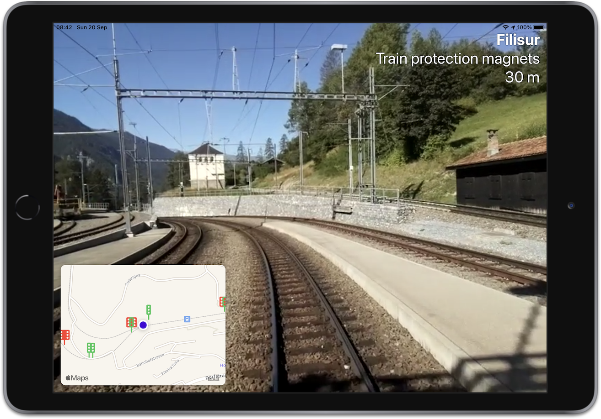

# Lift the Veil

## HackZurich 2020 Challenge #7: Siemens Mobility, Lift the Veil 

https://devpost.com/submit-to/10526-hackzurich-2020/submit/lift-the-veil-7-challenge/

I designed and coded a *working* iOS app entirely using SwiftUI and Combine. I also processed and re-encoded data and video, so that they can be bundled in the app for offline use (eventually these would be provisioned from a backend. 

My vision is that an iPad or other tablet could be installed in the driver’s cabin, giving him an awareness of the track regardless of visibility conditions.

The same system could also give passengers a glimpse of the route! 

[Video](https://youtu.be/UeVF03jz2qQ)